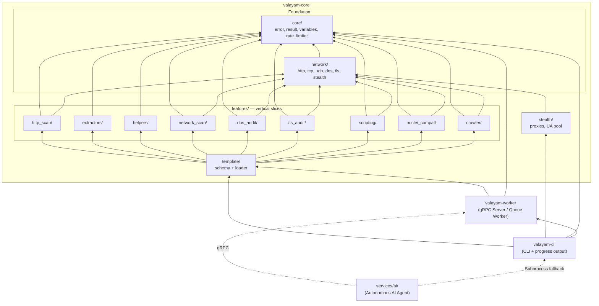

# Valayam Architecture

This document describes the **vertical slice architecture** of `valayam`. Each feature is a self-contained module owning its parser, executor, and matcher logic. Shared infrastructure lives in thin foundation layers (`core/`, `network/`).

## Directory Structure

```
valayam/
├── Cargo.toml                       # Virtual workspace manifest
├── crates/
│   ├── valayam-core/                # Shared library (Foundation + Features)
│   │   ├── Cargo.toml
│   │   └── src/
│   │       ├── lib.rs
│   │       ├── core/                # error.rs, result.rs, variables.rs, rate_limiter.rs
│   │       ├── network/             # http.rs, tcp.rs, udp.rs, dns.rs, tls.rs
│   │       ├── stealth/             # proxy.rs, user_agent.rs
│   │       ├── template/            # schema.rs, loader.rs
│   │       └── features/            # Vertical slices: http_scan, network_scan, scripting, etc.
│   │
│   ├── valayam-cli/                 # Command-line interface
│   │   ├── Cargo.toml
│   │   └── src/
│   │       └── main.rs              # CLI parsing (clap), orchestrator invocation, JSON output
│   │
│   └── valayam-worker/              # Distributed worker node (gRPC & TaskBroker queue mode)
│       ├── Cargo.toml
│       └── src/
│           ├── main.rs
│           └── broker/              # Redis, RabbitMQ, Kafka drivers
│
├── services/
│   └── ai/                          # Python AI Orchestration Layer
│       ├── requirements.txt
│       ├── valayam_client.py        # Python gRPC client & subprocess fallback
│       ├── agent.py                 # Autonomous multi-step recon loop agent
│       └── valayam_pb2.py           # Generated gRPC stubs
```

## Dependency Flow



## Design Principles

### 1. Vertical Slice Isolation
Each feature directory under `features/` is a complete vertical slice containing its own:
- **Parser** — YAML schema types (serde structs)
- **Executor** — Scan logic, matcher evaluation
- **Tests** — Unit and integration tests

Slices **never depend on each other**. They only depend downward on `core/` and `network/`.

### 2. Shared Variable Context
A `HashMap<String, String>` flows through the entire template execution pipeline. Each slice can:
- **Read** variables (e.g., `{{auth_token}}` in paths, headers, bodies)
- **Write** variables (extractors add captured values to the map)

The `core/variables.rs` module handles all `{{placeholder}}` resolution, including both variable substitution and helper function evaluation.

### 3. Template Orchestrator
The `template/loader.rs` is the **only** place where slices are composed. It executes phases in order:

```
HTTP Requests → Network Scan → DNS Audit → TLS Audit → Scripts
```

Each phase receives and can mutate the shared variable context.

### 4. Foundation Layers
- **`core/`** — Pure data types and utilities. No I/O, no network calls.
- **`network/`** — Protocol-level primitives shared by all slices. Thin wrappers around `reqwest`, `tokio::net`, `hickory-resolver`, `rustls`.

### 5. Stealth Layer
The `stealth/` module enhances `network/http.rs` transparently:
- Randomized User-Agent rotation
- SOCKS5/HTTP proxy cycling
- JA3/JA4 TLS fingerprint spoofing (Chrome/Safari signatures)

This is injected at the `StealthHttpClient` level, so all slices benefit without any code changes.

## Component Responsibilities

| Component | Responsibility |
|---|---|
| `valayam-cli` | CLI argument parsing (clap), progress display, JSON output, crawl options |
| `valayam-worker`| Daemonized distributed scanning node (gRPC server or Redis/RabbitMQ/Kafka task queue worker) |
| `services/ai/`| Python AI Agent for autonomous multi-step recon loop scanning |
| `core/error.rs` | Unified error enum for all slices |
| `core/result.rs` | `ScanResult` struct serialized to JSON |
| `core/variables.rs` | `{{var}}` substitution + `{{helper()}}` evaluation |
| `core/rate_limiter.rs` | Global token-bucket RPS limiter (governor) |
| `network/http.rs` | Async HTTP client with stealth features |
| `network/tcp.rs` | TCP connect scan + banner grabbing |
| `network/udp.rs` | UDP probe + response capture |
| `network/dns.rs` | DNS query resolution (A, AAAA, CNAME, TXT, MX) |
| `network/tls.rs` | TLS handshake + certificate extraction |
| `features/http_scan/` | HTTP request execution, regex/status matching |
| `features/extractors/` | Dynamic value extraction: regex and JSON pointer support |
| `features/helpers/` | DSL functions: base64, md5, sha256, hex, url_encode |
| `features/network_scan/` | Port scanning with banner regex matching |
| `features/dns_audit/` | DNS record querying + response matching |
| `features/tls_audit/` | Certificate expiry, cipher, issuer auditing |
| `features/scripting/` | Sandboxed Rhai engine with HTTP/TCP/crypto builtins |
| `features/nuclei_compat/` | Isolated Nuclei template parser + executor |
| `features/crawler/` | Enterprise crawler supporting HTML, JS/SPA routes, WASM, WebSockets, OpenAPI, and PostgREST |
| `stealth/` | JA3 spoofing, proxy rotation, UA randomization |
| `template/schema.rs` | Top-level `VulnerabilityTemplate` YAML schema |
| `template/loader.rs` | Orchestrates slice execution in sequence |
