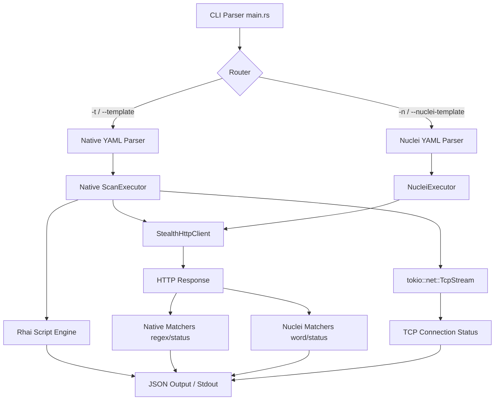

# valayam Architecture

This diagram illustrates the modular architecture of `valayam`, highlighting the strict isolation between Native and Nuclei template execution flows, while still sharing the high-performance network core.

## Component Breakdown

1. **CLI & Router**: The entry point. It parses arguments via `clap`. If `-t` is used, the workflow is routed entirely to the Native stack. If `-n` is used, it's routed to the isolated Nuclei stack.
2. **Parsers**: Native (`VulnerabilityTemplate`) and Nuclei (`NucleiTemplate`) have zero schema overlap.
3. **Executors**: Orchestrate variable substitution (e.g. `{{Hostname}}` for Native, `{{BaseURL}}` for Nuclei).
4. **Shared Network Core**: Both executors rely on the `StealthHttpClient` (a heavily optimized, cert-ignoring wrapper around `reqwest`) for maximum connection throughput.
5. **Matchers**: 
   - Native uses a zero-copy regex streaming evaluator.
   - Nuclei uses a custom fast substring (word) evaluator.
6. **Script Engine**: A sandboxed Rhai instance for complex, multi-step chains (Native templates only).
