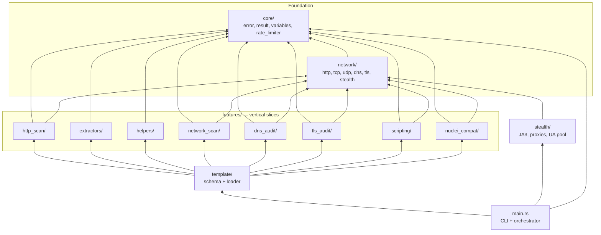

# Valayam Architecture

This document describes the **vertical slice architecture** of `valayam`. Each feature is a self-contained module owning its parser, executor, and matcher logic. Shared infrastructure lives in thin foundation layers (`core/`, `network/`).

## Directory Structure

```
src/
├── main.rs                          # CLI parsing, router, orchestrator
│
├── core/                            # Shared foundation (thin)
│   ├── mod.rs
│   ├── error.rs                     # Global error enum
│   ├── result.rs                    # ScanResult struct
│   ├── variables.rs                 # {{variable}} + {{helper()}} resolution
│   └── rate_limiter.rs              # Global token-bucket rate limiter
│
├── network/                         # Shared network clients
│   ├── mod.rs
│   ├── http.rs                      # StealthHttpClient
│   ├── tcp.rs                       # TCP connect + banner grab
│   ├── udp.rs                       # UDP probe primitives
│   ├── dns.rs                       # DNS resolver (hickory-resolver)
│   ├── tls.rs                       # TLS cert inspection (rustls + x509)
│   └── stealth.rs                   # UA pool, proxy rotation, JA3 spoofing
│
├── features/                        # Vertical feature slices
│   ├── mod.rs
│   ├── http_scan/                   # HTTP request scanning
│   │   ├── mod.rs
│   │   ├── parser.rs
│   │   ├── executor.rs
│   │   └── tests.rs
│   ├── extractors/                  # Dynamic value extraction
│   │   ├── mod.rs
│   │   ├── parser.rs
│   │   ├── engine.rs
│   │   └── tests.rs
│   ├── helpers/                     # DSL helper functions
│   │   ├── mod.rs
│   │   ├── parser.rs
│   │   ├── functions.rs
│   │   └── tests.rs
│   ├── network_scan/                # TCP/UDP port scanning + banners
│   │   ├── mod.rs
│   │   ├── parser.rs
│   │   ├── executor.rs
│   │   └── tests.rs
│   ├── dns_audit/                   # DNS query scanning
│   │   ├── mod.rs
│   │   ├── parser.rs
│   │   ├── executor.rs
│   │   └── tests.rs
│   ├── tls_audit/                   # TLS/SSL certificate auditing
│   │   ├── mod.rs
│   │   ├── parser.rs
│   │   ├── executor.rs
│   │   └── tests.rs
│   ├── scripting/                   # Rhai embedded scripting
│   │   ├── mod.rs
│   │   ├── parser.rs
│   │   ├── engine.rs
│   │   ├── builtins.rs
│   │   └── tests.rs
│   └── nuclei_compat/              # Nuclei template compatibility
│       ├── mod.rs
│       ├── parser.rs
│       ├── executor.rs
│       ├── matchers.rs
│       └── tests.rs
│
├── stealth/                         # Evasion & network stealth
│   ├── mod.rs
│   ├── fingerprint.rs               # JA3/JA4 TLS spoofing
│   ├── proxy.rs                     # SOCKS5/HTTP proxy rotation
│   ├── user_agent.rs                # Browser UA string pool
│   └── tests.rs
│
└── template/                        # Template orchestrator
    ├── mod.rs
    ├── loader.rs                    # YAML loading + execution routing
    └── schema.rs                    # Top-level VulnerabilityTemplate struct
```

## Dependency Flow



## Design Principles

### 1. Vertical Slice Isolation
Each feature directory under `features/` is a complete vertical slice containing its own:
- **Parser** — YAML schema types (serde structs)
- **Executor** — Scan logic, matcher evaluation
- **Tests** — Unit and integration tests

Slices **never depend on each other**. They only depend downward on `core/` and `network/`.

### 2. Shared Variable Context
A `HashMap<String, String>` flows through the entire template execution pipeline. Each slice can:
- **Read** variables (e.g., `{{auth_token}}` in paths, headers, bodies)
- **Write** variables (extractors add captured values to the map)

The `core/variables.rs` module handles all `{{placeholder}}` resolution, including both variable substitution and helper function evaluation.

### 3. Template Orchestrator
The `template/loader.rs` is the **only** place where slices are composed. It executes phases in order:

```
HTTP Requests → Network Scan → DNS Audit → TLS Audit → Scripts
```

Each phase receives and can mutate the shared variable context.

### 4. Foundation Layers
- **`core/`** — Pure data types and utilities. No I/O, no network calls.
- **`network/`** — Protocol-level primitives shared by all slices. Thin wrappers around `reqwest`, `tokio::net`, `hickory-resolver`, `rustls`.

### 5. Stealth Layer
The `stealth/` module enhances `network/http.rs` transparently:
- Randomized User-Agent rotation
- SOCKS5/HTTP proxy cycling
- JA3/JA4 TLS fingerprint spoofing (Chrome/Safari signatures)

This is injected at the `StealthHttpClient` level, so all slices benefit without any code changes.

## Component Responsibilities

| Component | Responsibility |
|---|---|
| `main.rs` | CLI argument parsing (clap), progress display, JSON output |
| `core/error.rs` | Unified error enum for all slices |
| `core/result.rs` | `ScanResult` struct serialized to JSON |
| `core/variables.rs` | `{{var}}` substitution + `{{helper()}}` evaluation |
| `core/rate_limiter.rs` | Global token-bucket RPS limiter (governor) |
| `network/http.rs` | Async HTTP client with stealth features |
| `network/tcp.rs` | TCP connect scan + banner grabbing |
| `network/udp.rs` | UDP probe + response capture |
| `network/dns.rs` | DNS query resolution (A, AAAA, CNAME, TXT, MX) |
| `network/tls.rs` | TLS handshake + certificate extraction |
| `features/http_scan/` | HTTP request execution, regex/status matching |
| `features/extractors/` | Regex capture → variable extraction from responses |
| `features/helpers/` | DSL functions: base64, md5, sha256, hex, url_encode |
| `features/network_scan/` | Port scanning with banner regex matching |
| `features/dns_audit/` | DNS record querying + response matching |
| `features/tls_audit/` | Certificate expiry, cipher, issuer auditing |
| `features/scripting/` | Sandboxed Rhai engine with HTTP/TCP/crypto builtins |
| `features/nuclei_compat/` | Isolated Nuclei template parser + executor |
| `stealth/` | JA3 spoofing, proxy rotation, UA randomization |
| `template/schema.rs` | Top-level `VulnerabilityTemplate` YAML schema |
| `template/loader.rs` | Orchestrates slice execution in sequence |
